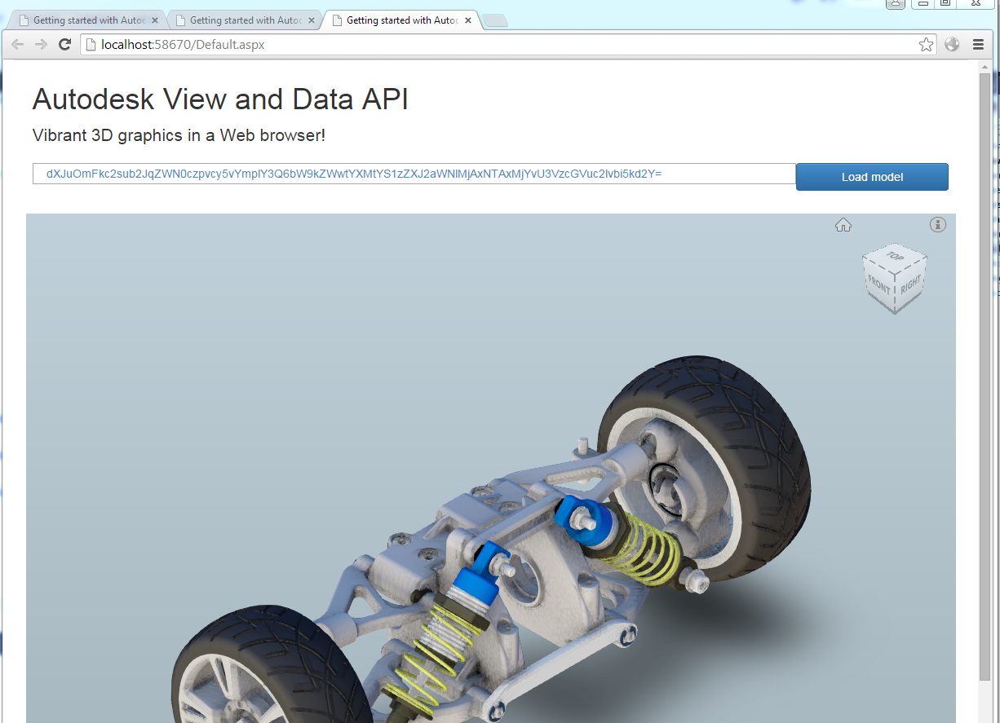
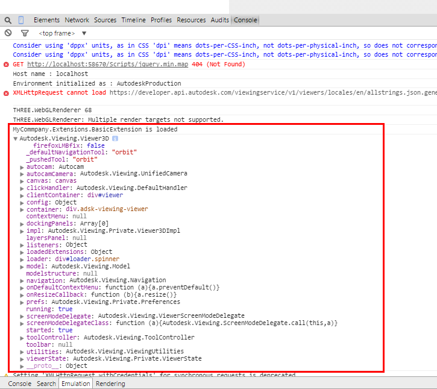
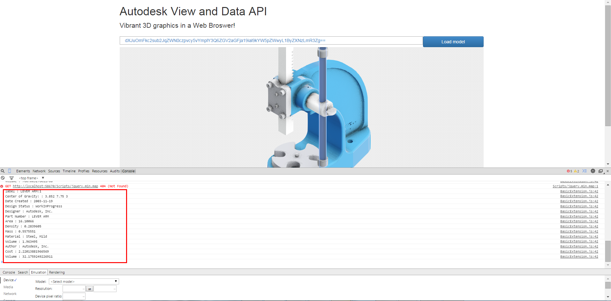

# Getting started with Autodesk View and Data API

**Pre-requisites**

Install Visual Studio 2012 or Visual Studio 2013

## Get Keys

Log in [http://developer.autodesk.com](http://developer.autodesk.com) with your Autodesk ID and create an App to get your consumer key and secret key. Please refer to [this tutorial](https://github.com/Developer-Autodesk/tutorial-getting.started-view.and.data/blob/master/chapter-1.md#ObtainingAnAPIKey) for detail.

## Prepare models

To prepare viewable models, you need to upload and register your model with View and Data API, please refer to the [code samples](http://developer-autodesk.github.io/)on github.com for the workflow. 

For simplicity of this exercise, we provide different ways to prepare your model. You can following [This tutorial](https://github.com/Developer-Autodesk/tutorial-getting.started-view.and.data/blob/master/chapter-1.md#PrepareAModel) to prepare models.


## Practice labs

This repository includes two projects, "FirstViewerWebApp - lab" is the uncompleted version, and you can do the exercise to complete following task yourself by following the steps below. If you have problems when doing this, please refer to the completed project in "FirstViewerWebApp" folder.

### TASK 1 – complete the basic web application with viewer

* Open the web application **FirstViewerWebApp.sln** in "FirstViewerWebApp - exercise" folder
* Go to **default.aspx** , examine the page layout

  - Add style sheet of "view and data web service" in `<head> </head>` tag:
```
	<link type="text/css" rel="stylesheet" href="https://viewing.api.autodesk.com/viewingservice/v1/viewers/style.css" />
```

  - Add JavaScript library, just before `</body>` :
```
        <!--JS library of viewer-->
    <script type="text/javascript" src="https://developer.api.autodesk.com/viewingservice/v1/viewers/viewer3D.min.js"></script>
```

* Go to **/Scripts/Viewer.js,** add following JavaScript in the function **Initialize** 
```
        var urn = $('#urn').val();
       //default model urn, you need to change is to your own
       if (urn =='') {
           urn = 'urn:dXJuOmFkc2sub2JqZWN0czpvcy5vYmplY3Q6ZGFuaWVsX3RyYW5zbGF0ZV9idWNrZXQzL0RyaWxsLmR3Zng=';
       }
       if (urn.substr(0,4) !=='urn:') {
           urn = 'urn:' + urn;
       }


       var options = {
           'document': urn,
           'getAccessToken': getToken, //a function callback which returns access token
           'refreshToken': getToken, //a function callback which returns access token
       };


       var viewerElement = document.getElementById('viewer');


       //Create the viewer object, with some extensions in array
       //If you do not load any extensions, the second parameter can be
       //an empty object {}


       viewer = new Autodesk.Viewing.Private.GuiViewer3D(viewerElement, {
           extensions: ['BasicExtension']
       });

       //initializer the viewer


       Autodesk.Viewing.Initializer(options, function () {


           viewer.start();


           //load the model document into the viewer


           loadDocument(viewer, options.document);
       });


```

4.Complete the necessary JavaScript functions 
```
    function loadDocument(viewer, documentId) {
        // Find the first 3d geometry and load that.
        Autodesk.Viewing.Document.load(documentId, function (doc) {// onLoadCallback
            var geometryItems = [];
            geometryItems = Autodesk.Viewing.Document.getSubItemsWithProperties(
                doc.getRootItem(), {
                'type': 'geometry',
                'role': '3d'}, true);


            if (geometryItems.length > 0) {
                viewer.load(doc.getViewablePath(geometryItems[0]));
            }
        }, function (errorMsg) {// onErrorCallback
            alert("Load Error: " + errorMsg);
        });
    }


    // This method returns a valid access token
    function getToken() {
        // This method should fetch a token from a service you create to provide authentication.
        // See the ADN Samples for examples of how to create such a service.  For example, see
        // https://github.com/Developer-Autodesk/workflow-aspnet-webform-view.and.data.api/blob/master/ViewAndShare/ViewAndShare/GetAccessToken.ashx.cs
        // This method might look something like:
        var xmlHttp = null;
        xmlHttp = new XMLHttpRequest();
        xmlHttp.open("GET", "GetAccessToken.aspx", false);
        xmlHttp.send(null);
        var res = xmlHttp.responseText;
        var newToken = JSON.parse(res);


        if (newToken.error) {
            console.log(newToken.error);
            return '';


        }
        else {
            return newToken.access\_token;
        }


    }
```

* Go to **Credentials.cs** , replace with your consumer key and secret:
```
        //replace your consumer key
        public static string CONSUMMER_KEY = "your-consumer-key";
        public static string SECRET_KEY = "your-secret-key";
```

* Launch the web project; fill in your URN (you get it in step- [prepare viewable model]) and click "load model" button to load the viewer

* Debug and fix any issue.

* If everything works well, you should see the model is loaded in the viewer.




### TASK 2 – Create a simple extension, display the properties in Chrome console when element is selected

Target: Create a viewer extension to output the properties of selected element on viewer

* Go to **BasicExtension.js** and complete the handler of selection changed event.
```
	var dbIdArray = event.dbIdArray;


	for (var i = 0; i < dbIdArray.length; i++) {


		var dbId = dbIdArray[i];


		oViewer.getProperties(dbId, function (result) {
			if (result.properties) {


				for (var i = 0; i < result.properties.length; i++) {


					var prop = result.properties[i];


					//output the property name and value to console of browser


					console.log(prop.displayName + ' : ' + prop.displayValue);


				}
			}
		});
	}
```

* Debug and fix any issue. Launch the application in Chrome, go to console of Developer tools in Chrome, you should see the message is logged: 

"MyCommpany.Extensions.BasicExtension is loaded"



* Select one element on model, and check the output in console, the property name and value should display.




## Help Documents:

[http://developer-dev.api.autodesk.com/documentation/v1/index.html](http://developer-dev.api.autodesk.com/documentation/v1/index.html)

More samples:

[https://developer-autodesk.github.io/](https://developer-autodesk.github.io/)